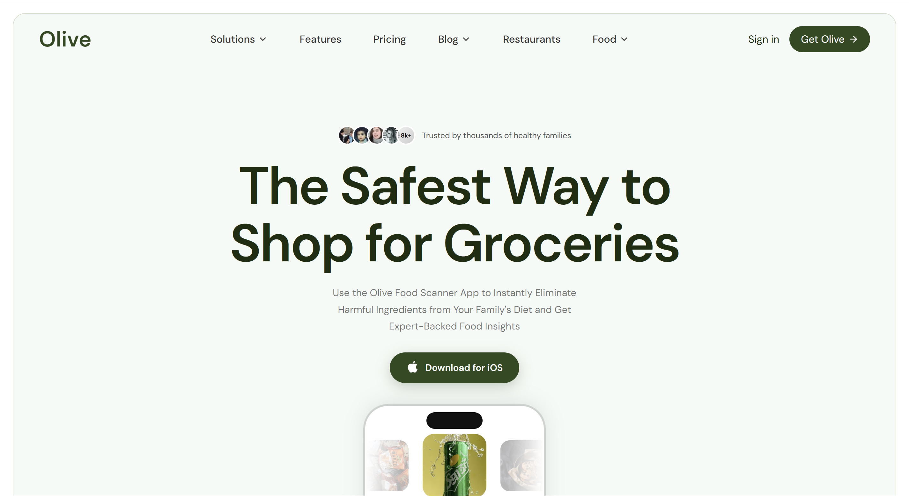

# Olive App - Frontend Clone

> A pixel-perfect frontend recreation of [oliveapp.com](https://www.oliveapp.com/), built as part of a Full Stack Developer Intern assessment for **Hire My Idea / Praxso**.

---

## Preview



---

## Time Spent

| Phase | Time |
|---|---|
| Design analysis & planning | ~1.5 hrs |
| Component architecture & setup | ~1 hr |
| Hero + Navbar | ~2 hrs |
| HowItWorks section | ~2 hrs |
| HealthBenefits section | ~2.5 hrs |
| ProtectFamily + Independent sections | ~1.5 hrs |
| FAQ + FamilySafe sections | ~1.5 hrs |
| Footer | ~1 hr |
| Responsiveness & bug fixes | ~2 hrs |
| **Total** | **~15 hrs** |

---

## Tools & Technologies

| Category | Tech |
|---|---|
| **Framework** | React.js (Vite) |
| **Animation** | Framer Motion |
| **Icons** | Lucide React |
| **Styling** | Plain CSS (component-scoped) |
| **Fonts** | Google Fonts — DM Sans |
| **Version Control** | Git + GitHub |
| **AI Assistance** | Claude (Anthropic), ChatGPT | 
| **Dev Server** | Vite |

---

## How I Built This

### 1. Project Structure
I started by setting up a clean Vite + React project and organized it for scalability:

```
hire-my-idea-assignment/
└── frontend/
    ├── src/
    │   ├── components/       # One file per section
    │   │   ├── Navbar.jsx
    │   │   ├── Hero.jsx
    │   │   ├── HowItWorks.jsx
    │   │   ├── HealthBenefits.jsx
    │   │   ├── ProtectFamily.jsx
    │   │   ├── Independent.jsx
    │   │   ├── FAQ.jsx
    │   │   ├── FamilySafe.jsx
    │   │   └── Footer.jsx
    │   ├── styles/           # One CSS file per component
    │   │   ├── Navbar.css
    │   │   ├── Hero.css
    │   │   └── ...
    │   ├── App.jsx
    │   ├── index.css         # Global variables + reset
    │   └── main.jsx
    └── package.json
```

### 2. Component-Driven Approach
Each section of the page is a completely self-contained component with its own CSS file. This keeps the codebase clean, maintainable, and easy to debug - exactly how production codebases work.

### 3. Design Analysis
I carefully inspected the original website using Chrome DevTools to understand:
- The exact color palette (`#2d4a1e`, `#f5faf6`, etc.)
- Font weights and spacing
- Layout structure (Tailwind classes mapped to plain CSS)
- Animation behavior (carousel, scroll triggers, marquee)

### 4. Key Animations Built
- **Hero Carousel** - Auto-sliding product images with Framer Motion, centered active item
- **HowItWorks** - Animated barcode scan line, marquee auto-highlight at center, upward-scrolling strips
- **HealthBenefits** - Score count-up on scroll using `IntersectionObserver`, alternating tag row animations
- **ProtectFamily** - Cross-fade image slideshow with dot indicators
- **FAQ** - Smooth accordion with opacity + max-height transition

---

## Why React?

React was the natural choice for this project for several reasons:

- **Component reusability** - Each section is isolated, making it easy to maintain and extend
- **State management** - Features like the FAQ accordion, image carousel, and score counter required reactive state, which React handles elegantly with `useState` and `useEffect`
- **Ecosystem** - Libraries like Framer Motion and Lucide React integrate seamlessly
- **Industry standard** - React is widely used in production, making the codebase immediately familiar to any developer joining the project
- **Vite** - Paired with Vite for an extremely fast development experience with instant HMR

---

## Live Links

| | Link |
|---|---|
| **Live Demo** | [View Deployed Site](https://olive-clone-hmi.vercel.app/) |
| **GitHub Repo** | [https://github.com/Amolraut638/Olive-clone.git]() |
| **Original Site** | [oliveapp.com](https://www.oliveapp.com/) |

> ⚠️ Note: This project is built purely for assessment purposes. All design credit goes to the Olive App team.

---

## Getting Started

```bash
# Clone the repository
git clone https://github.com/Amolraut638/Olive-clone.git

# Navigate to frontend
cd Olive-clone/frontend

# Install dependencies
npm install

# Start development server
npm run dev

# Build for production
npm run build
```

---

## Folder Structure Philosophy

```
components/   -  JSX logic only, no inline styles
styles/       -  One CSS file per component, scoped class names
public/       -  Static assets (images, icons)
index.css     -  CSS variables, reset, global body styles only
```

This structure was intentional - in real projects, CSS-in-JS or Tailwind would be used, but plain scoped CSS was chosen here to demonstrate a deep understanding of CSS fundamentals without relying on utility frameworks.

---

## Future Enhancements

Given more time, here's what I would add next:

- [ ] **Backend integration** - Node.js + Express API for the newsletter subscription
- [ ] **MongoDB** - Store subscriber emails in a database
- [ ] **Product barcode scanner** - Using a JS barcode library to simulate real scanning
- [ ] **Authentication** - Sign in / Sign up flow with JWT
- [ ] **Android section** - Add Android download CTA when available
- [ ] **Blog page** - Fully functional blog with search and filters
- [ ] **Accessibility** - ARIA labels, keyboard navigation, screen reader support
- [ ] **i18n** - Multi-language support
- [ ] **Dark mode** - Toggle between light and dark themes
- [ ] **PWA** - Make it installable as a Progressive Web App
- [ ] **Performance** - Lazy loading images, code splitting, Lighthouse 100 score

---

## About Me

**Amol** - Full Stack Developer passionate about building clean, performant, and visually polished web applications.

- Skills: C, C++, Java, JavaScript, React, Node.js, TypeScript, MongoDB
- Currently exploring: New frontend frameworks and backend architectures
- Open to opportunities and collaborations

---

## License

This project is for **assessment and educational purposes only**.  
Original design belongs to © Olive App / oliveapp.com.

---

<p align="center">Built with ❤️ by Amol</p>